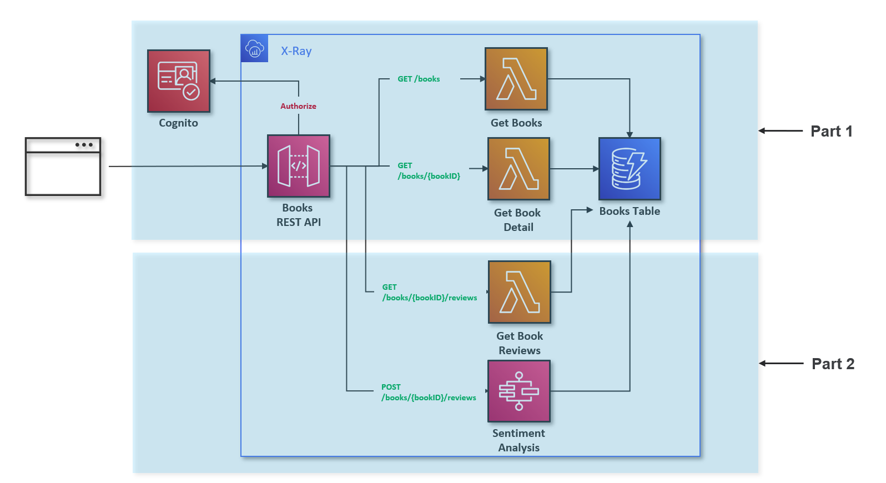
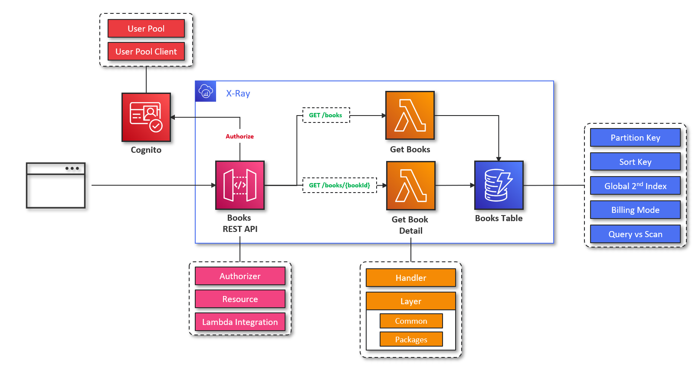
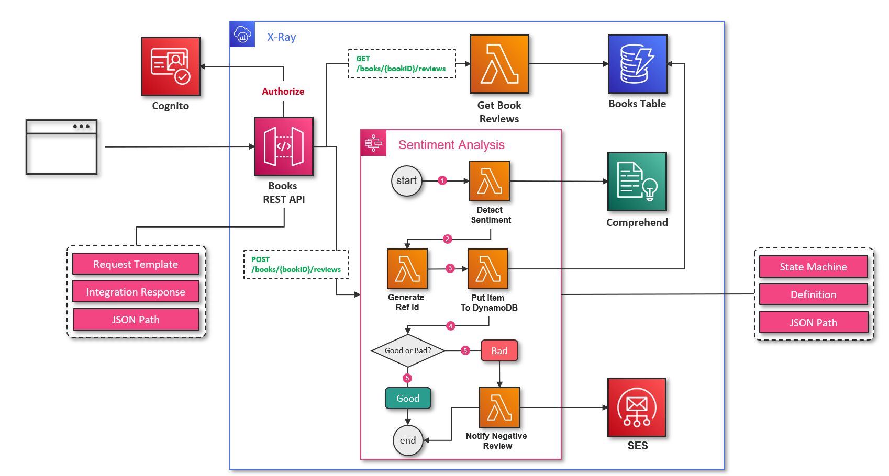

# Module 1 - Books Service

## Cognito Services
- Create `.env` file from `.env.sample` and update the relevant variables.
```bash
# Move to 'workshop-2' directory
cd workshop-2
# Export the environment variables to the shell
export $(grep -v '^#' .env | xargs)
```
```bash
# Deploy Cognito Services with CDK
cdk deploy --profile ${AWS_USERNAME}
```
## Book API Services
### Part 1: Book Resource Endpoints



- Install source dependencies.

```bash
pip install -r src/requirements.txt -t src/packages/python
```

- Set `STACK_BOOK_ENABLED` in `.env` to `true` then export the variables to the terminal again.
```bash
# Export the environment variables to the shell
export $(grep -v '^#' .env | xargs)
```

- Then deploy the cdk stack again using `cdk deploy`. You can also run `cdk synth` before the deployment and have a look on `cdk.out` folder to see the changes in the stack.

```bash
# Deploy Book Services with CDK
cdk deploy --profile ${AWS_USERNAME}
```

- Replace `<AWS_USERNAME>` with your AWS Username in [src/seeders/data-seeder.json](../src/seeders/data-seeder.json) (***line 2***).
```javascript
{
    "<AWS_USERNAME>Books":[ // => Replace <AWS_USERNAME> with your AWS Username (For example: sd0001)
        ...
    ]
}
```

- Run Data Seeder for DynamoDB Books Table
```bash
aws dynamodb batch-write-item --profile ${AWS_USERNAME} --request-items file://./src/seeders/data-seeder.json
```

## Part 2: Book Review Resource Endpoints



- Set `STACK_BOOK_REVIEW_ENABLED` in `.env` to `true` then export the variables to the terminal again.
```bash
# Export the environment variables to the shell
export $(grep -v '^#' .env | xargs)
```

- Then deploy the cdk stack again using `cdk deploy`.
```bash
# Deploy Book Services with CDK
cdk deploy --profile ${AWS_USERNAME}
```
