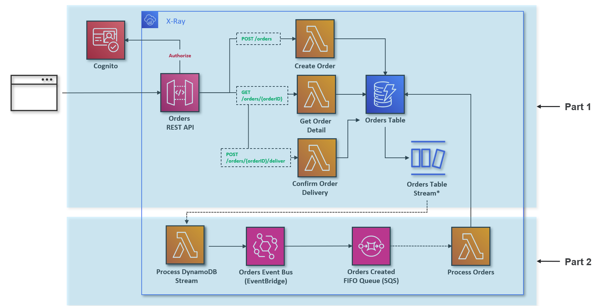
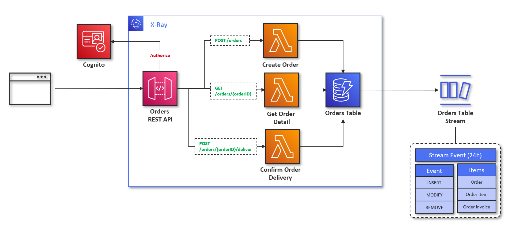
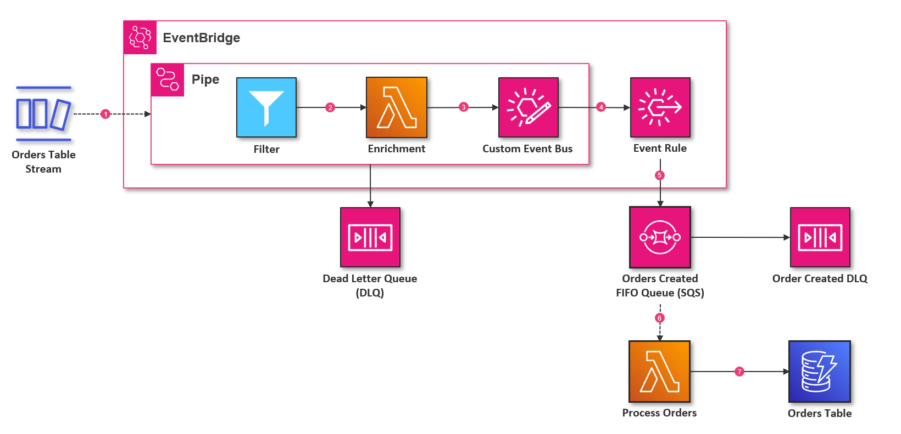

# Module 2 - Order Service


## Cognito Service
- Create `.env` file from `.env.sample` and update the relevant variables.
```bash
# Move to 'workshop-2' directory
cd workshop-2
# Export the environment variables to the shell
export $(grep -v '^#' .env | xargs)
```
```bash
# Deploy Cognito Services with CDK
cdk deploy --profile ${AWS_USERNAME}
```
***Note: Just Skip this step if you already walk through this step in Module 1.***

## Order API Service
### Part 1: Order Resource Endpoint

- Install source dependencies (skip this step if you already walk through this step in Module 1).
```bash
pip install -r src/requirements.txt -t src/packages/python
```

- Set `STACK_ORDER_ENABLED` in `.env` to `true` then export the variables to the terminal again.
```bash
# Export the environment variables to the shell
export $(grep -v '^#' .env | xargs)
```

- Then deploy the cdk stack again using `cdk deploy`. You can also run `cdk synth` before the deployment and have a look on `cdk.out` folder to see the changes in the stack.
```bash
# Deploy Order Service with CDK
cdk deploy --profile ${AWS_USERNAME}
```
## Part 2: Order Event Lambda Processor
- Set `STACK_ORDER_PROCESSOR_ENABLED` in `.env` to `true` then export the variables to the terminal again.
```bash
# Export the environment variables to the shell
export $(grep -v '^#' .env | xargs)
```

- Deploy the cdk stack again using `cdk deploy`.
```bash
# Deploy Order Service with CDK
cdk deploy --profile ${AWS_USERNAME}
```
- Play around with Order API when create order, use `X-Ray`, `Cloudwatch Logs` to get information on flow and log data.

## Part 3(Alternatives): Order Processing EventBridge Pipe

***Note: It is recommended that you should only enable one feature at a time to have a good exploration on the pattern. Enable both features is okay if you can play around simotanously processing stream event using 2 separate flows, then you may need to update lambda function 'ProcessOrder' to support consitent read***
- Set `STACK_ORDER_PROCESSOR_ENABLED` in `.env` to `false`.
- Set `STACK_ORDER_PIPE_ENABLED` in `.env` to `true`.
- Export the variables to the terminal again.
```bash
# Export the environment variables to the shell
export $(grep -v '^#' .env | xargs)
```
- Deploy the cdk stack again using `cdk deploy`.
```bash
# Deploy Order Services with CDK
cdk deploy --profile ${AWS_USERNAME}
```

## Clean Up All Stacks
```bash
# Destroy All Stacks
cdk destroy --profile ${AWS_USERNAME}
```
